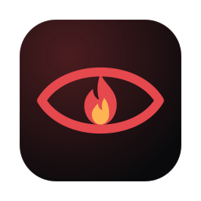
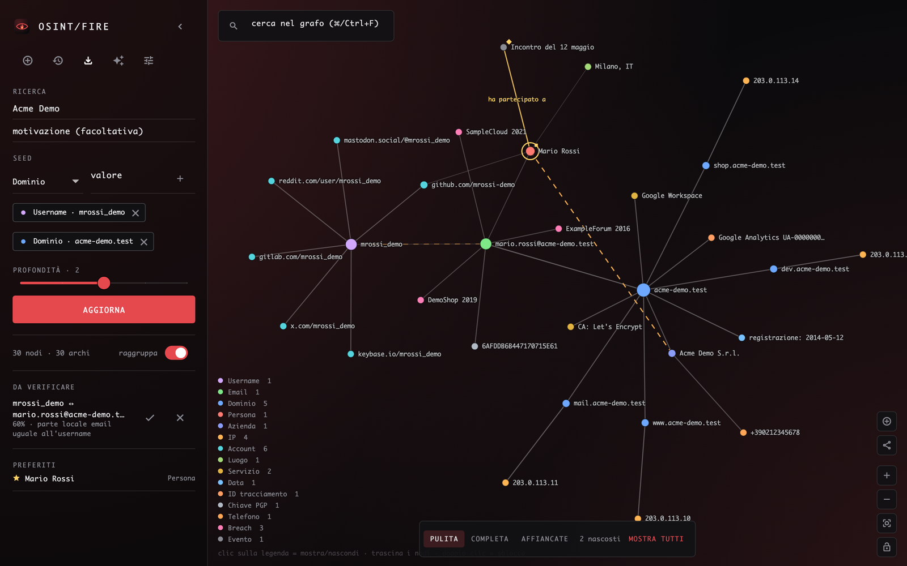
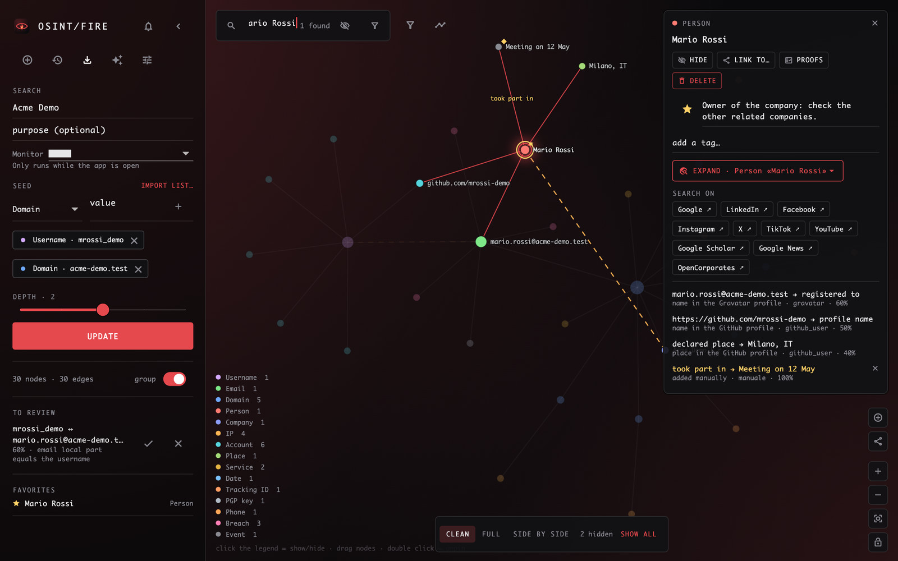
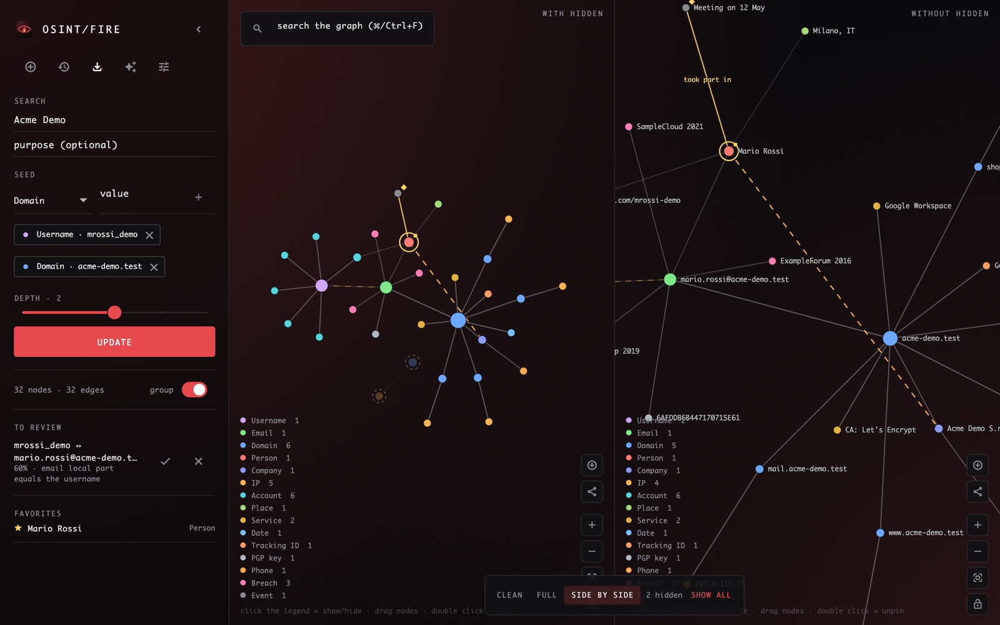
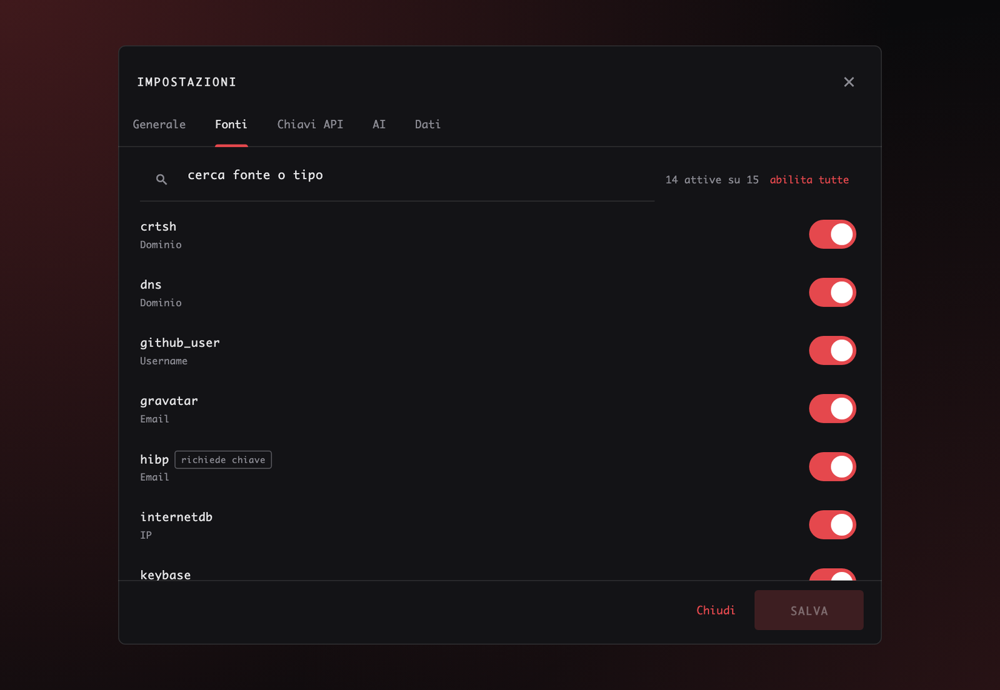
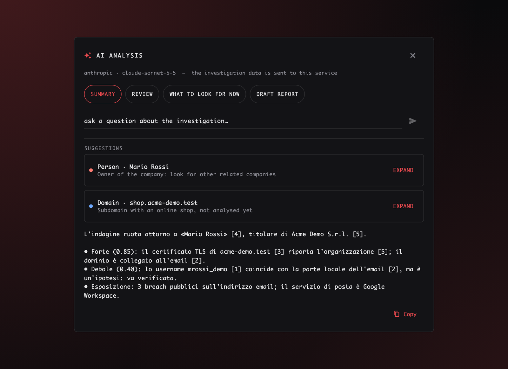
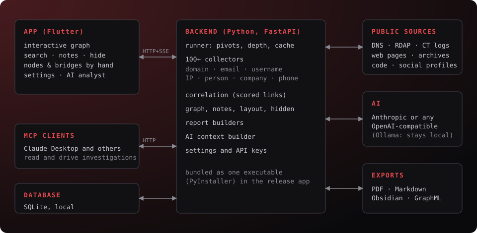

<p align="center"></p>

<h1 align="center">OSINT-Fire</h1>

<p align="center">
  Collect public information about a domain, an email, a username, an IP, a person, a company or a phone number,<br>
  link it in an interactive graph and keep working on it.
</p>

<p align="center">
  
  
  
</p>

<p align="center"></p>

> The interface comes in English, Italian, Spanish and German (Settings → General, it follows your system language on first start). Everything runs on your computer: investigations, notes and API keys never leave it
> (unless you choose a cloud AI provider, see [AI](#ai)).

## What it does

- **Searches many sources at once.** From a seed (`example.com`, `jane@example.com`, `jdoe`, `203.0.113.5`, a name, a company, a phone)
  170+ collectors query DNS, certificate transparency, RDAP/WHOIS, web archives, code and social platforms, breach indexes,
  registries and more. Every result keeps its source and a confidence.
- **Follows the trail.** What a source finds (an email on a website, a username in a profile) becomes a new seed, down to the depth you choose.
  Expand any node later, or **refresh** the whole search to pick up what is new.
- **Draws a graph you can work in.** Drag nodes, search, add notes and stars, hide or delete nodes (what hung only from them goes with them),
  create your own nodes and bridges, and look at the graph clean, complete or both side by side.
- **Links the evidence.** Same profile picture, same SSH/PGP key, same tracking ID, same phone: scored "same subject" links you confirm or reject.
- **Remembers how you left it.** Reopen a search and it is as you left it: seed list, node positions, camera, hidden nodes.
- **Filters, tags and timeline.** Filter by confidence, source, notes, favourites, tags; tag nodes (`suspect`, `verified`…); see dated facts
  (registrations, breaches, your own events, search runs) on a timeline.
- **Shows what changed.** After every run, a banner says what is new since the last one, and you can look at only that.
- **Watches for you.** Choose "every N days" on a search: while the app is open it re-runs it and raises an alert when something new appears.
- **Keeps proofs.** Save a copy of the page behind a finding with its time and SHA-256; optionally ask the Internet Archive for a copy too (it is told the address, so it is off unless you tick it).
- **Imports lists.** Paste a list or CSV of domains, emails, IPs, phones, handles and review the detected seeds.
- **Exports and imports.** PDF, Markdown, an Obsidian vault, GraphML, a lossless archive you can import back (also into another computer), and customisable reports (pick sections, title, header/footer, logo; PDF, Markdown or one standalone HTML file).
- **Connects to AI.** An analyst panel (summary, review, what to search next) and an MCP server so assistants like Claude Desktop can drive it.

<p align="center">
  <br>
  <sub>A node selected: relations with their source and confidence, notes, expand, manual lookups, hide / delete.</sub>
</p>

<p align="center">
  <br>
  <sub>Hidden nodes: the same investigation with them (faded, left) and without them (right).</sub>
</p>

## Get it running

### Download a build
[The build workflow](.github/workflows/build.yml) runs the tests and builds both apps on every push to `main` (the zips are in the run's *Artifacts*),
and attaches `OSINT-Fire-windows.zip` and `OSINT-Fire-macos.zip` to every published GitHub release.
Unzip and start `OSINT-Fire.exe` (Windows) or `OSINT-Fire.app` (macOS).
The builds are not signed: Windows SmartScreen / macOS Gatekeeper will ask you to confirm the first start.

### Build it yourself

**macOS** — needs [uv](https://docs.astral.sh/uv/), [Flutter](https://docs.flutter.dev/get-started/install/macos/desktop) and Xcode:
```bash
git clone https://github.com/Zarrilli-Antonio/OSINT-Fire.git
cd OSINT-Fire
./scripts/build_app.sh          # -> dist/OSINT-Fire.app
open dist/OSINT-Fire.app
```

**Windows 10/11** — needs [Git](https://git-scm.com/download/win), [uv](https://docs.astral.sh/uv/), [Flutter](https://docs.flutter.dev/get-started/install/windows/desktop)
and Visual Studio 2022 with the *Desktop development with C++* workload (`flutter doctor` tells you what is missing):
```powershell
winget install --id=astral-sh.uv -e
git clone https://github.com/Zarrilli-Antonio/OSINT-Fire.git
cd OSINT-Fire
powershell -ExecutionPolicy Bypass -File scripts\build_app.ps1     # -> dist\OSINT-Fire\OSINT-Fire.exe  (+ dist\OSINT-Fire-windows.zip)
.\dist\OSINT-Fire\OSINT-Fire.exe
```
The Windows build is produced by the same code and by CI on every push, but it has been written on a Mac:
if something does not work on your PC, please open an issue with the output of `flutter doctor -v` and of the script.

### Run from source (development)
```bash
cd backend && uv run python run_backend.py        # API on http://127.0.0.1:8765
cd app && flutter run -d macos                    # or: -d windows
```
Started from source, the app launches the backend itself with `uv run python run_backend.py` if nothing answers on port 8765.
Tests: `cd backend && uv run pytest` and `cd app && flutter test`.

Data lives in `~/Library/Application Support/OSINT-Fire/osint.db` (macOS), `%APPDATA%\OSINT-Fire\osint.db` (Windows), or `backend/osint.db`
when run from source. It is plain SQLite and holds your investigations **and your API keys**: do not share or commit it.

## Settings

<p align="center"></p>

Settings (sliders icon) cover: which sources run (and which of them contact the target's own servers: a *passive only* mode skips those),
cache lifetime, proxy (e.g. Tor), request limits, domains never followed (gmail.com & co), social search from emails and names,
optional API keys, the AI connector, and data maintenance (clear cache, backup, delete everything).

**Connected accounts** use the *official* API of each platform with your own credentials (GitHub, Reddit, Twitch, YouTube, Spotify, X, plus VirusTotal,
Shodan, Hunter, HIBP and others). Facebook, Instagram and LinkedIn offer no API to look people up and forbid automated use of an account,
so OSINT-Fire does not log into them: the **SEARCH ON** buttons open the search in your browser instead, where you are already signed in.

## AI

<p align="center"></p>

- **Analyst panel**: summary, review of false positives, "what to search next" (with one-click expand) and a report draft, using Anthropic or any
  OpenAI-compatible endpoint (OpenAI, Ollama, LM Studio, OpenRouter). The model only returns text. With Ollama nothing leaves your machine;
  with a cloud provider the investigation graph is sent to it (your private notes only if you enable it).
- **MCP server** so an assistant can start, read, expand and annotate investigations while the app is open. The ready-to-paste configuration is in
  *Settings → AI*; manually: `<app folder>/backend/osint-backend --mcp` (`OSINT-Fire.app/Contents/Resources/backend/osint-backend` on macOS, `backend\osint-backend.exe` on Windows) or, from source, `uv run --directory backend --extra mcp python -m osint.mcp_server`.

## How it is built

<p align="center"></p>

```
app/        Flutter desktop UI (macOS, Windows)
backend/    Python 3.13, FastAPI, SQLite: runner, collectors, correlation, reports, AI, MCP
scripts/    build_app.sh (macOS), build_app.ps1 (Windows), license and image helpers
docs/       README pictures (regenerated from fictional data, see below)
```
Adding a source means writing one function that returns findings and decorating it with `@collector(...)` (see `backend/osint/collectors/`);
each source ships with a parser test using canned responses.

The README pictures come from `app/test/screenshots_test.dart`, on fictional data with reserved domains:
`cd app && SCREENSHOTS=1 flutter test --update-goldens test/screenshots_test.dart && cd .. && python3 scripts/shrink_images.py`.

## Use it responsibly
OSINT-Fire only queries public sources and documented APIs and does not bypass logins, captchas or rate limits. You are responsible for
having a legitimate reason and for following the law (GDPR for personal data) and each service's terms. Results are leads, not proof:
the same username or name on two sites does not make the same person, which is why every link carries a confidence.

## License
[MIT](LICENSE) © 2026 Antonio Zarrilli. Third-party components and their licenses: [THIRD_PARTY_NOTICES.md](THIRD_PARTY_NOTICES.md)
(regenerate with `scripts/third_party_notices.py`).
